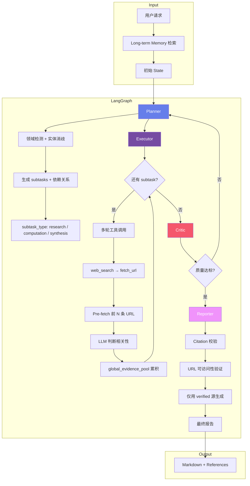
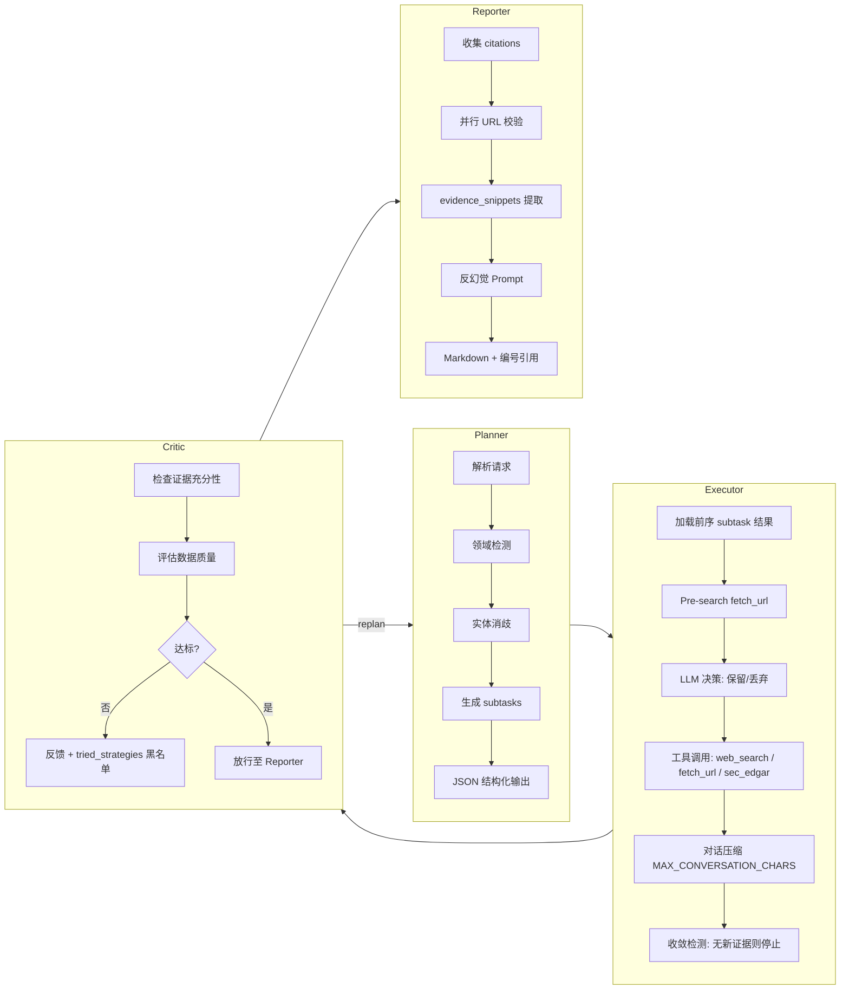
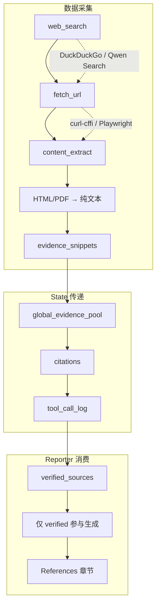

# DeepReport

基于 LangGraph 的多智能体协作研究引擎，面向金融、生物科技等领域的深度研报自动生成。支持任务分解、多轮工具调用、Critic 闭环纠错、证据溯源与引用校验，产出带可验证引用的结构化报告。


---

## 项目结构

```
src/agent_engine/
├── agents/                # 多智能体核心
│   ├── planner.py         # 任务分解与子任务规划
│   ├── executor.py        # 多轮工具调用执行
│   ├── validator.py       # 子任务结果校验
│   ├── critic.py          # 质量评审与 replan 决策
│   ├── reporter.py        # 引用校验 + 报告生成
│   ├── graph.py           # LangGraph 状态图编排
│   ├── state.py           # GraphState 定义
│   ├── domain_profile.py  # 领域检测与数据源策略
│   ├── entity_resolver.py # 实体消歧与别名扩展
│   └── domains/           # 可插拔领域配置
│       ├── biotech_finance.md
│       └── generic.md
├── tools/
│   ├── builtin/           # 内置工具集
│   │   ├── web_search.py, http_client.py, content_extract.py
│   │   ├── sec_edgar.py, rag_reader.py, code_exec.py, file_ops.py
│   │   └── ...
│   ├── registry.py        # MCP 工具注册表
│   └── executor.py        # 工具执行引擎
├── llm/                   # LLM 提供方
│   ├── qwen.py            # Qwen (DashScope)
│   ├── minimax.py         # Minimax
│   └── router.py          # 模型路由
├── api/                   # FastAPI REST + WebSocket
├── memory/                # pgvector 长期记忆
├── persistence/           # PostgreSQL checkpoint 持久化
├── budget/                # Token / 步数 / 工具调用预算控制
└── llm_logger.py          # LLM 调用全链路日志
```

---

## 核心特性

| 特性 | 说明 |
|------|------|
| **多智能体编排** | Planner → Executor → Critic → Reporter，支持 Critic 打回 replan 闭环纠错 |
| **领域自适应** | 可插拔领域配置（`domains/*.md`），实体消歧与搜索词扩展 |
| **证据溯源链** | 从 web_search / fetch_url 到 citation 的完整链路，Reporter 仅引用 verified 源 |
| **大文档检索** | RAG + TOC 分页，支持 SEC 10-K、HKEX 年报等超长 PDF 精准定位 |
| **多 LLM 支持** | Qwen (DashScope)、Minimax 可切换，统一 ChatOpenAI 接口 |
| **持久化与恢复** | PostgreSQL + pgvector 存储任务状态、检查点与向量记忆 |
| **全链路可观测** | `llm_logger` 记录每次 LLM 调用的输入/输出/token 消耗，支持调用链分析 |

---

## 技术架构

```
┌───────────────────────────────────────────────────────────────────────┐
│                     FastAPI (REST + WebSocket)                        │
│               /tasks, /tasks/{id}/stream, /tools                     │
└───────────────────────────────┬───────────────────────────────────────┘
                                │
┌───────────────────────────────▼───────────────────────────────────────┐
│                       LangGraph StateGraph                            │
│                                                                       │
│  ┌──────────┐   ┌──────────┐   ┌─────────┐   ┌──────────┐            │
│  │ Planner  │──▶│ Executor │──▶│  Critic │──▶│ Reporter │            │
│  │ 任务分解  │   │ 工具执行  │   │ 质量评审 │   │ 报告生成  │            │
│  └──────────┘   └──────────┘   └────┬────┘   └──────────┘            │
│       ▲                             │                                 │
│       └─────── replan ──────────────┘                                 │
└───────────────────────────────┬───────────────────────────────────────┘
                                │
┌───────────────────┬───────────┴───────────┬───────────────────────────┐
│  MCP Tool Registry│ Long-term Memory      │ Postgres Checkpoint       │
│  web_search       │ pgvector 向量检索      │ 任务中断/恢复              │
│  fetch_url        │ text-embedding-v4     │ thread_id 持久化           │
│  sec_edgar        │ task_id 关联历史上下文  │                           │
│  search_document  │                       │                           │
│  code_execute     │                       │                           │
└───────────────────┴───────────────────────┴───────────────────────────┘
```

---

## 整体执行流程



---

## 多智能体协作流程



---

## 数据流与证据链路



---

## 技术栈

| 层级 | 技术 |
|------|------|
| **编排** | LangGraph 0.2, LangChain 0.3 |
| **LLM** | Qwen (DashScope), Minimax, LangChain ChatOpenAI |
| **向量** | pgvector, text-embedding-v4 (1024d) |
| **存储** | PostgreSQL + asyncpg, SQLAlchemy 2.0 |
| **工具** | DuckDuckGo Search, curl-cffi, Playwright, PyMuPDF, Trafilatura |
| **API** | FastAPI, WebSocket 流式输出 |
| **前端** | 单页 HTML + Marked.js 渲染 Markdown |
| **可观测** | llm_logger 全链路 LLM 调用日志 |

---

## 内置工具

| 工具 | 用途 |
|------|------|
| `web_search` | 搜索引擎查询，支持 DuckDuckGo / Qwen 内置搜索 |
| `fetch_url` | 抓取网页/PDF，支持 HTML 解析与 Playwright 渲染，自动提取正文 |
| `search_document` | 大文档 RAG 检索：TOC 分页 + 向量检索，精准定位超长 PDF 段落 |
| `sec_edgar_filings` | SEC EDGAR filings 列表查询 |
| `sec_edgar_financials` | SEC 10-K/10-Q 结构化财务数据提取 |
| `code_execute` | 沙箱 Python 代码执行（数据计算与分析） |
| `read_file` / `write_file` / `list_directory` | 本地文件读写与目录浏览 |

---

## 执行链路详解

### 1. Planner

- **输入**：`user_request` + `memory_context` + `tried_strategies`（失败策略黑名单）
- **输出**：`subtasks`（含 id、description、dependencies、subtask_type、suggested_tools）
- **领域增强**：`domain_profile` 注入领域专属数据源策略，`entity_resolver` 做实体消歧与别名扩展
- **Replan 支持**：Critic 打回时，根据 `tried_strategies` 避免重复失败路径

### 2. Executor

- **多轮循环**：每个 subtask 最多 `MAX_TOOL_ROUNDS=5` 轮工具调用
- **Pre-fetch**：web_search 返回后自动 fetch 前 N 条 URL 全文，LLM 判断保留/丢弃
- **上下文控制**：`MAX_CONVERSATION_CHARS=60k` 触发对话压缩，保留最近 `KEEP_RECENT_ROUNDS=3` 轮
- **跨 subtask 共享**：`global_evidence_pool` 供后续 subtask 复用已采集证据

### 3. Critic（质量评审）

- **证据充分性检查**：评估采集到的数据是否足够回答用户问题
- **Replan 决策**：质量不达标时打回 Planner 重新规划，同时将失败策略加入 `tried_strategies` 黑名单
- **闭环控制**：`max_iterations` 限制最大 replan 次数，防止无限循环

### 4. Reporter

- **Citation 校验**：并行请求所有引用 URL，标记 `verified` / `unverified`
- **反幻觉规则**：仅从 verified 源提取数据，禁止编造数字或事实
- **引用格式**：`[N]` 编号对应 References 章节中的稳定引用

### 5. 持久化与记忆

- **Checkpoint**：每节点执行后写入 PostgreSQL，支持任务中断后 `resume`
- **Long-term Memory**：pgvector 存储历史任务摘要，相似任务自动检索上下文

---

## 示例输出

以下为一次实际运行的统计数据（任务：某上市生物科技公司投资价值分析）：

| 指标 | 数值 |
|------|------|
| LLM 调用次数 | 94 次 |
| 总 Token 消耗 | 562,816（输入 495,460 + 输出 67,356） |
| 报告长度 | ~5,000 词，8 个章节 |
| 引用来源 | 12 条 verified URL（SEC filings、BioSpace、FiercePharma 等） |
| 运行时间 | ~15 分钟 |

**产出报告结构**：Executive Summary → Company Fundamentals → Pipeline Analysis → Financial Analysis → Competitive Landscape → Risk Assessment → Investment Thesis → References

每个数据点均通过 `[N]` 编号关联到 References 中的具体 URL，可逐条验证。

---

## 效果与亮点

- **可验证引用**：报告中的每个数据点可追溯到具体 URL 与 evidence snippet
- **闭环纠错**：Critic 评审不达标时自动 replan，`tried_strategies` 防止重复失败
- **大文档友好**：RAG + TOC 分页，避免整份 10-K 塞入上下文
- **领域可扩展**：新增领域仅需添加 `domains/*.md` 配置文件，无需改代码
- **资源可控**：`max_tokens`、`max_steps`、`max_tool_calls` 三重预算限制
- **全链路可观测**：`llm_logger` 记录每次 LLM 调用的完整输入输出与 token 消耗，支持事后分析与调优

---

## 快速开始

### 环境要求

- Python 3.11+
- Docker（PostgreSQL + pgvector）
- Poetry

### 启动步骤

```bash
# 1. 克隆并配置
git clone https://github.com/wenyi-jupiter/Wenyi-research-agent.git
cd Wenyi-research-agent
cp .env.example .env
# 编辑 .env，配置 DASHSCOPE_API_KEY 等

# 2. 启动数据库
docker-compose up -d

# 3. 安装依赖
poetry install

# 4. 数据库迁移
poetry run alembic upgrade head

# 5. 启动服务
poetry run agent-engine
```

### 访问

- **API / 前端**：http://localhost:8000（静态 `frontend/index.html`）
- **API 文档**：http://localhost:8000/docs

---

## 配置说明

| 变量 | 说明 | 默认值 |
|------|------|--------|
| `DEFAULT_LLM_PROVIDER` | LLM 提供方（qwen / minimax） | qwen |
| `DASHSCOPE_API_KEY` | 阿里云 DashScope API Key | - |
| `MAX_TOKENS` | 单任务 token 上限 | 500000 |
| `MAX_STEPS` | 最大执行步数（LLM 调用次数） | 100 |
| `MAX_TOOL_CALLS` | 最大工具调用次数 | 200 |
| `EMBEDDING_DIMENSION` | 向量维度 | 1024 |

---

## 脚本

| 脚本 | 用途 |
|------|------|
| `scripts/run_with_llm_log.py` | 命令行执行任务，记录全部 LLM 调用到 `llm_logs/`，生成 token 消耗统计 |
| `scripts/validate_pdf_fetch.py` | 验证 PDF fetch 与内容提取功能 |

---

## License

MIT
