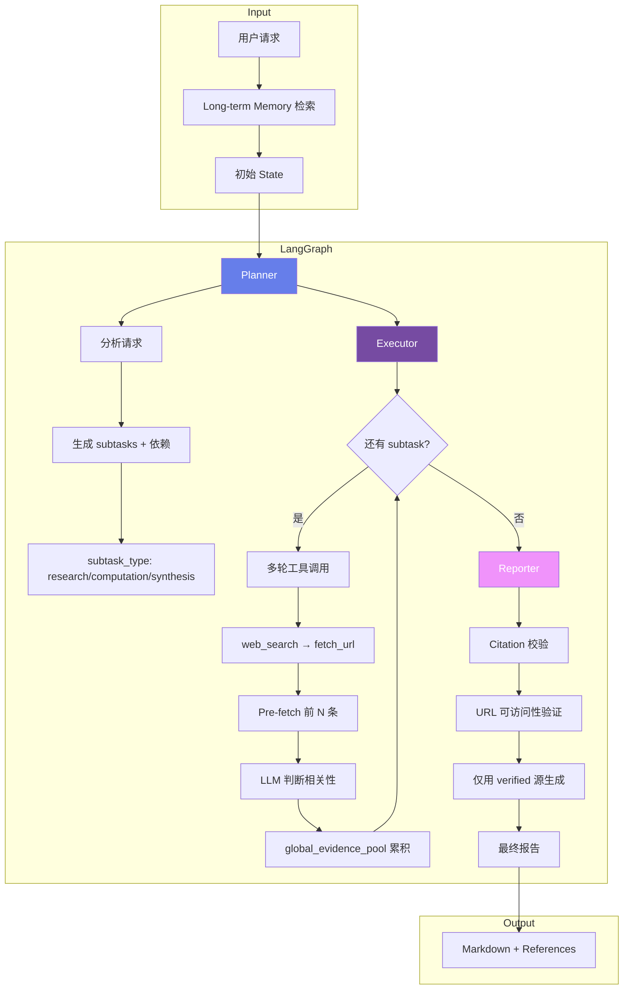
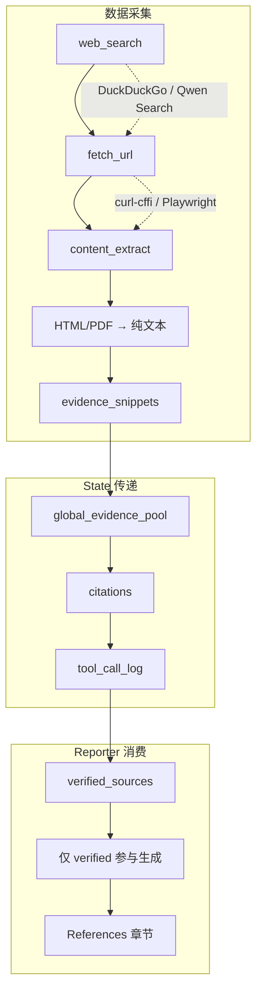

# Wenyi Research Agent

基于 LangGraph 的多智能体协作研究引擎，面向金融/生物科技等领域的深度研报生成。支持任务分解、多轮工具调用、证据溯源与引用校验，产出带可验证引用的结构化报告。

---

## 核心特性

| 特性 | 说明 |
|------|------|
| **多智能体编排** | Planner → Executor → Reporter 分层架构，Executor 完成后直连 Reporter |
| **领域自适应** | 可插拔领域配置（biotech_finance、generic），实体消歧与搜索词扩展 |
| **证据溯源链** | 从 fetch_url/web_search 到 citation 的完整链路，Reporter 仅引用 verified 源 |
| **大文档检索** | RAG + TOC 分页，支持 SEC 10-K、HKEX 年报等超大 PDF 精准定位 |
| **多 LLM 支持** | Qwen (DashScope)、Minimax 可切换，统一 ChatOpenAI 接口 |
| **持久化与恢复** | PostgreSQL + pgvector 存储任务状态、检查点与向量记忆 |

---

## 技术架构

```
┌─────────────────────────────────────────────────────────────────────────────┐
│                           FastAPI (REST + WebSocket)                        │
│                     /tasks, /tasks/{id}/stream, /tools                      │
└─────────────────────────────────────┬───────────────────────────────────────┘
                                      │
┌─────────────────────────────────────▼───────────────────────────────────────┐
│                         LangGraph StateGraph                                 │
│  ┌──────────┐     ┌──────────────┐     ┌──────────┐                          │
│  │ Planner  │────▶│   Executor   │────▶│ Reporter │                          │
│  │ 任务分解  │     │ 多轮工具执行  │     │ 报告生成  │                          │
│  └──────────┘     └──────────────┘     └──────────┘                          │
└─────────────────────────────────────┬───────────────────────────────────────┘
                                      │
┌─────────────────────┬───────────────┴───────────────┬──────────────────────┐
│   MCP Tool Registry │   Long-term Memory (pgvector) │   Postgres Checkpoint │
│ web_search,fetch_url│   text-embedding-v4 向量检索   │   任务中断/恢复        │
│ sec_edgar,code_exec │   task_id 关联历史上下文       │   thread_id 持久化     │
│ rag_reader,file_ops │                               │                       │
└─────────────────────┴───────────────────────────────┴───────────────────────┘
```

---

## 整体执行流程



---

## 多智能体协作流程

```mermaid
flowchart LR
    subgraph Planner
        P1[解析请求] --> P2[领域检测]
        P2 --> P3[实体消歧]
        P3 --> P4[生成 subtasks]
        P4 --> P5[JSON 结构化输出]
    end

    subgraph Executor
        E1[加载前序 subtask 结果] --> E2[Pre-search fetch_url]
        E2 --> E3[LLM 决策: 保留/丢弃]
        E3 --> E4[工具调用: web_search/fetch_url/sec_edgar]
        E4 --> E5[对话压缩 MAX_CONVERSATION_CHARS]
        E5 --> E6[收敛检测: 无新证据则停止]
    end

    subgraph Reporter
        R1[收集 citations] --> R2[并行 URL 校验]
        R2 --> R3[evidence_snippets 提取]
        R3 --> R4[反幻觉 Prompt]
        R4 --> R5[Markdown + [N] 引用]
    end

    Planner --> Executor
    Executor --> Reporter
```

---

## 数据流与证据链路



---

## 技术栈

| 层级 | 技术 |
|------|------|
| **编排** | LangGraph 0.2, LangChain 0.3 |
| **LLM** | Qwen (DashScope), Minimax, LangChain ChatOpenAI |
| **向量** | pgvector, text-embedding-v4 (1024d) |
| **存储** | PostgreSQL + asyncpg, SQLAlchemy 2.0 |
| **工具** | DuckDuckGo Search, curl-cffi, Playwright, PyMuPDF, Trafilatura |
| **API** | FastAPI, WebSocket 流式输出 |
| **前端** | 单页 HTML + Marked.js 渲染 Markdown |

---

## 内置工具

| 工具 | 用途 |
|------|------|
| `web_search` | 搜索引擎查询，支持 DuckDuckGo / Qwen 内置搜索 |
| `fetch_url` | 抓取 URL，支持 HTML/PDF 解析，自动提取正文 |
| `sec_edgar_filings` | SEC EDGAR  filings 列表 |
| `sec_edgar_financials` | SEC 10-K/10-Q 财务数据 |
| `code_execute` | 沙箱 Python 代码执行 |
| `rag_reader` | 大文档 RAG：TOC 分页 + 向量检索 |
| `read_file` / `write_file` / `list_directory` | 本地文件操作 |

---

## 执行链路详解

### 1. Planner

- **输入**：`user_request` + `memory_context` + `tried_strategies`
- **输出**：`subtasks`（含 id、description、dependencies、subtask_type、suggested_tools）
- **领域增强**：`domain_profile` 注入数据源策略，`entity_resolver` 做实体消歧与别名扩展

### 2. Executor

- **多轮循环**：每 subtask 最多 `MAX_TOOL_ROUNDS=5` 轮
- **Pre-fetch**：web_search 返回后自动 fetch 前 N 条 URL 全文，LLM 判断保留/丢弃
- **上下文控制**：`MAX_CONVERSATION_CHARS=60k` 触发对话压缩，保留最近 `KEEP_RECENT_ROUNDS=3` 轮
- **跨 subtask 共享**：`global_evidence_pool` 供后续 subtask 复用

### 3. Reporter

- **Citation 校验**：并行请求 URL，标记 `verified` / `unverified`
- **反幻觉规则**：仅从 verified 源提取数字，禁止编造
- **引用格式**：`[N]` 对应 References 中的稳定 ID

### 4. 持久化

- **Checkpoint**：每节点执行后写入 PostgreSQL，支持 `resume`
- **Memory**：pgvector 存储任务摘要，相似任务检索历史上下文

---

## 效果与亮点

- **可验证引用**：报告中的每个数据点可追溯到具体 URL 与 evidence snippet
- **大文档友好**：RAG + TOC 分页，避免整份 10-K 塞入上下文
- **领域可扩展**：新增领域仅需添加 `domains/*.md`，无需改代码
- **Token 可控**：`max_tokens`、`max_steps`、`max_tool_calls` 三重限制
- **LLM 调用日志**：`llm_logger` 支持按任务记录调用序列与 token 消耗

---

## 快速开始

### 环境要求

- Python 3.11+
- Docker（PostgreSQL + pgvector）
- Poetry

### 启动步骤

```bash
# 1. 克隆并配置
git clone https://github.com/wenyi-jupiter/Wenyi-research-agent.git
cd Wenyi-research-agent
cp .env.example .env
# 编辑 .env，配置 DASHSCOPE_API_KEY 等

# 2. 启动数据库
docker-compose up -d

# 3. 安装依赖
poetry install

# 4. 数据库迁移
poetry run alembic upgrade head

# 5. 启动服务
poetry run agent-engine
```

### 访问

- **API / 前端**：http://localhost:8000（静态 `frontend/index.html`）
- **文档**：http://localhost:8000/docs

---

## 配置说明

| 变量 | 说明 | 默认 |
|------|------|------|
| `DEFAULT_LLM_PROVIDER` | qwen / minimax | qwen |
| `DASHSCOPE_API_KEY` | 阿里云 DashScope | - |
| `MAX_TOKENS` | 单任务 token 上限 | 100000 |
| `MAX_STEPS` | 最大步数 | 50 |
| `MAX_TOOL_CALLS` | 最大工具调用次数 | 100 |
| `EMBEDDING_DIMENSION` | 向量维度 | 1024 |

---

## 脚本

| 脚本 | 用途 |
|------|------|
| `scripts/run_with_llm_log.py` | 命令行执行任务并记录 LLM 调用到 `llm_logs/` |
| `scripts/validate_pdf_fetch.py` | 验证 PDF fetch 与内容提取 |

---


## License

MIT
